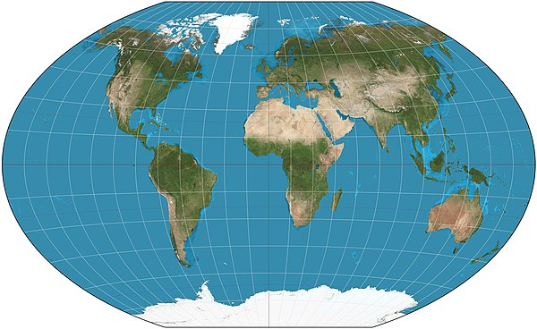

<a name="readme-top"></a>


<div align="center">

<h1><b>Global info search</b></h1>

</div>

<!-- TABLE OF CONTENTS -->

# 📗 Table of Contents

- [📗 Table of Contents](#-table-of-contents)
- [📖Global-web-metrics](#global-web-metrics)
  - [🛠 Built With ](#-built-with-)
    - [Tech Stack ](#tech-stack-)
    - [Key Features ](#key-features-)
  - [🚀 Live Demo ](#-live-demo-)
  - [💻 Getting Started ](#-getting-started-)
    - [Prerequisites](#prerequisites)
    - [Setup](#setup)
    - [Install](#install)
    - [Usage](#usage)
    - [Run tests](#run-tests)
    - [Deployment](#deployment)
  - [👥 Authors ](#-authors-)
  - [🔭 Future Features ](#-future-features-)
  - [🤝 Contributing ](#-contributing-)
  - [⭐️ Show your support ](#️-show-your-support-)
  - [🙏 Acknowledgments ](#-acknowledgments-)
  - [📝 License ](#-license-)

<!-- PROJECT DESCRIPTION -->

# 📖Global-web-metrics<a name="about-project"></a>

**Global-web-metrics** is a web application for a searching information of countries on the globe. The mobile designed application will allow users to search information about any country in the world.

## 🛠 Built With <a name="built-with"></a>

### Tech Stack <a name="tech-stack"></a>

<details>
  <summary>Text Editor</summary>
  <ul>
    <li><a href="https://code.visualstudio.com/">Visual Studio Code</a></li>
  </ul>
</details>

<details>
  <summary>Client</summary>
  <ul>
    <li><a href="https://developer.mozilla.org/en-US/docs/Web/HTML">HTML</a></li>
    <li><a href="https://react.dev/">React.js</a></li>
  </ul>
</details>

<details>
<summary>Style</summary>
  <ul>
    <li><a href="https://developer.mozilla.org/en-US/docs/Web/CSS">CSS</a></li>
     <li><a href="https://react-bootstrap.github.io/docs/getting-started/introduction">React-bootstrap</a></li>
  </ul>
</details>

<details>
<summary>Test</summary>
  <ul>
    <li><a href="https://jestjs.io/">React testing library and Jest</a></li>
     
  </ul>
</details>

### Key Features <a name="key-features"></a>
- **Searching specific country information**
- **Displaying detail information about a country**


<p align="right">(<a href="#readme-top">back to top</a>)</p>

## 🚀 Live Demo <a name="live-demo"></a>
- [Live Demo Link - Available on render(https://global-web-meterics.onrender.com/)
- Available on loom](https://www.loom.com/share/4e611c60a12247228506edfaf45fdec8)

<p align="right">(<a href="#readme-top">back to top</a>)</p>

## 💻 Getting Started <a name="getting-started"></a>

To get a local copy up and running, follow these steps.

### Prerequisites

In order to run this project you need:
- Browser
- Code Editor
- Node.js

### Setup

Clone this repository to your desired folder:

```sh
  cd web-matrics
  git clone https://github.com/ghermaico135/react-capstone-project.git
```

### Install

Install this project with:

```sh
  cd /web-matrics
  npm install
```

### Usage

To run the project, execute the following command:

```sh
  npm start
```

### Run tests

To run tests, run the following command:

```sh
  npm test
```

### Deployment

This project deploy using Render:

- Available on render(https://global-web-meterics.onrender.com/)


<p align="right">(<a href="#readme-top">back to top</a>)</p>

## 👥 Authors <a name="authors"></a>

👤 **Michael Gebrezghiabihier okbamichael**

- GitHub: [@ghermaico135](https://github.com/ghermaico135)
- Twitter: [@mikidarling3](https://twitter.com/mikidarling3)
- LinkedIn: [Miki](https://www.linkedin.com/in/michael-okbamichael-966106263/)

<p align="right">(<a href="#readme-top">back to top</a>)</p>

<!-- FUTURE FEATURES -->

## 🔭 Future Features <a name="future-features"></a>
- [ ] **downloading country information**


<p align="right">(<a href="#readme-top">back to top</a>)</p>

<!-- CONTRIBUTING -->

## 🤝 Contributing <a name="contributing"></a>

Contributions, issues, and feature requests are welcome!

Feel free to check the [issues page]((https://github.com/ghermaico135/react-capstone-project/issues)).

<p align="right">(<a href="#readme-top">back to top</a>)</p>

<!-- SUPPORT -->

## ⭐️ Show your support <a name="support"></a>

If you like this project give it a `star`.

<p align="right">(<a href="#readme-top">back to top</a>)</p>

<!-- ACKNOWLEDGEMENTS -->

## 🙏 Acknowledgments <a name="acknowledgements"></a>
Original design idea by Nelson Sakwa on Behance.

The Creative Commons license of the design requires that you give appropriate credit to the author. Therefore, you must do it in the README of your project.

I would like to thank Microverse and my Coding Partners.
I would like to thank Nelson Sakwa on Behance and Creative Commons  design
<p align="right">(<a href="#readme-top">back to top</a>)</p>

<!-- LICENSE -->

## 📝 License <a name="license"></a>

This project is [MIT](./LICENSE) licensed.

<p align="right">(<a href="#readme-top">back to top</a>)</p>